# DeepLer: Multi-Language Machine Translator for Moodle

[](https://github.com/brunobaudry/moodle-local_deepler/actions/workflows/moodle-ci.yml)
[](https://github.com/brunobaudry/moodle-local_deepler/actions/workflows/moodle-ci.yml)
[](https://github.com/brunobaudry/moodle-local_deepler/actions/workflows/moodle-ci.yml)
[](https://sonarcloud.io/summary/new_code?id=brunobaudry_moodle-local_deepler)
[](https://sonarcloud.io/summary/new_code?id=brunobaudry_moodle-local_deepler)
[](https://github.com/brunobaudry/moodle-local_deepler/blob/main/LICENSE)

**DeepLer** makes translating and improving entire Moodle courses fast, simple, and central. Instead of opening every section, quiz, and activity one by one to manually add translation tags, DeepLer allows course creators, teachers, and administrators to view, translate, review, and save all course content from a **single, unified page** using the **DeepL Translation API**.

---

## Table of Contents

- [Why DeepLer?](#why-deepler)
- [Requirements](#requirements)
- [Installation](#installation)
- [Quick Start: Translating a Course](#quick-start-translating-a-course)
- [Course Translation Features](#course-translation-features)
  - [Interface & Content Filters](#interface--content-filters)
  - [Status Indicators](#status-indicators)
  - [Rephrasing and Text Improvement](#rephrasing-and-text-improvement)
  - [Image and Media Previews](#image-and-media-previews)
  - [Formulas and Technical Formatting](#formulas-and-technical-formatting)
- [Glossaries (Custom Terminology)](#glossaries-custom-terminology)
  - [How Glossaries Work](#how-glossaries-work)
  - [Creating Your Glossary File](#creating-your-glossary-file)
  - [Managing and Sharing Glossaries](#managing-and-sharing-glossaries)
- [Administrator Configuration](#administrator-configuration)
  - [Main Settings & API Keys](#main-settings--api-keys)
  - [Token Manager (Multi-User API Keys)](#token-manager-multi-user-api-keys)
  - [User Capabilities & Permissions](#user-capabilities--permissions)
  - [Additional Field Configuration (Advanced JSON)](#additional-field-configuration-advanced-json)
- [Tips & Best Practices for Course Creators](#tips--best-practices-for-course-creators)
- [Compatibility](#compatibility)
- [Contributing & Development](#contributing--development)

---

## Why DeepLer?

In traditional Moodle setups, building a multilingual course requires manually editing each activity description, quiz question, and section heading using `{mlang}` tags. 

**DeepLer streamlines this process into a clear 4-step workflow:**
1. **Centralize:** Automatically collects all text fields across the entire course on one page.
2. **Translate & Rephrase:** Sends text directly to DeepL with your preferred tone and terminology.
3. **Review:** Allows human translators and educators to review and adjust suggestions in-place.
4. **Save:** Automatically writes clean Moodle multi-language tags (`{mlang}`) back to the database.

Because translations are saved directly within standard Moodle content, **your translated courses remain fully compatible with Moodle backups, restores, and standard exports**.

---

## Requirements

To use DeepLer, your Moodle environment requires:
- **[Multi-Language Content (v2) Filter](https://moodle.org/plugins/filter_multilang2)** (required dependency to display translated content dynamically to learners).
- A **DeepL API Account**:
  - **DeepL API Free** or **DeepL API Pro** for multi-language translations.
  - **DeepL API Pro** for text improvement and rephrasing in the same language.

---

## Installation

1. Download or clone this plugin repository into your Moodle installation at:
   ```text
   /path/to/moodle/local/deepler
   ```
2. Navigate to **Site Administration → Notifications** to complete the standard database upgrade.
3. Ensure that the **Multi-Language Content (v2)** filter is installed and enabled under **Site Administration → Plugins → Filters → Manage filters**.

---

## Quick Start: Translating a Course

### 1. Open the Translator
Navigate to the course you wish to translate, open the course **Actions menu** (gear icon or course navigation), and select **DeepL Translator**.

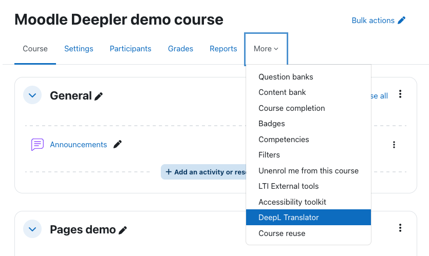

### 2. Choose Source and Target Languages
- **Source Language:** Automatically reflects your current Moodle language. Set this to the language the course was originally written in.
- **Target Language:** Select the language you want to translate your course into from the dropdown menu.

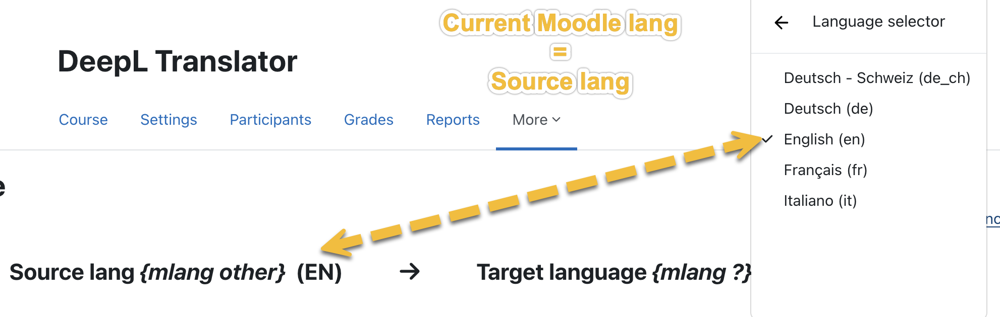
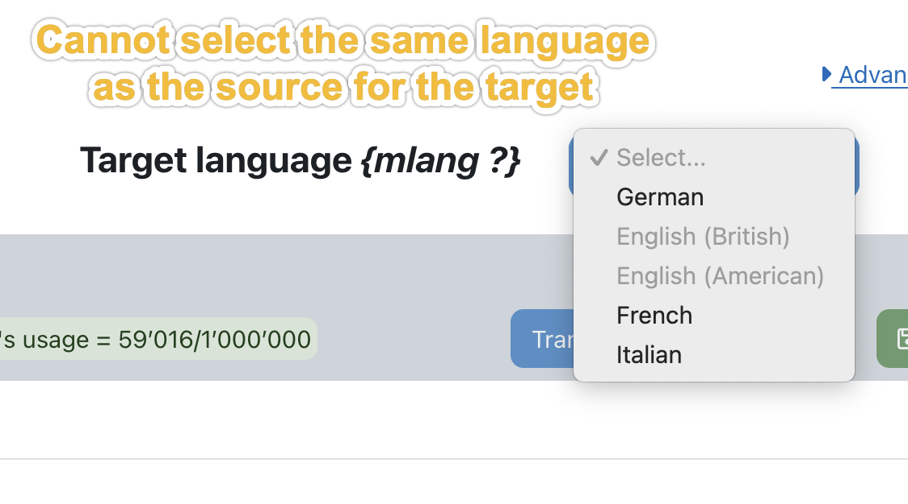

### 3. Select Content & Translate
- Use the filters to choose whether to view the whole course, a specific section, or an individual activity.
- Select the items you want to translate and click the **Translate** button to query DeepL.

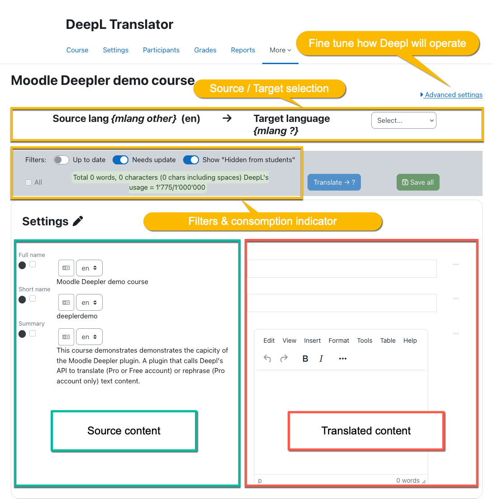

### 4. Review & Save
- DeepL's translations appear directly in the editable fields for your review.
- Make any desired pedagogical adjustments.
- Click **Save** on individual rows or use **Save All** to store the translations in Moodle.

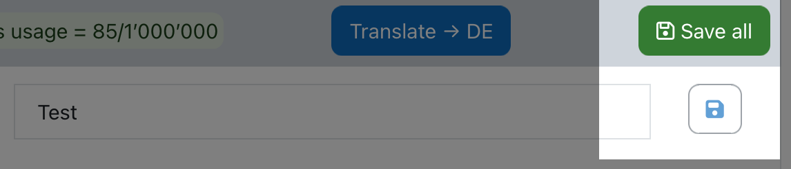

---

## Course Translation Features

### Interface & Content Filters

Translating large courses can feel overwhelming. DeepLer provides intuitive filters to keep your workspace organized:

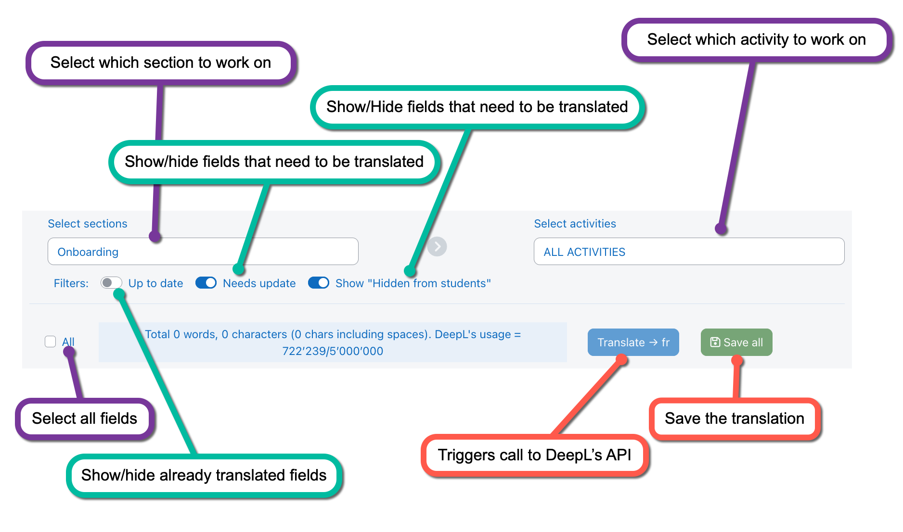

- **Section & Activity Filter:** Focus on specific sections or activities rather than loading the entire course at once.
- **Translation Status Filter:** Show only items that are up to date, need updating, or have never been translated.
- **Show/Hide Hidden Items:** Toggle whether hidden sections or activities appear in the translation list.

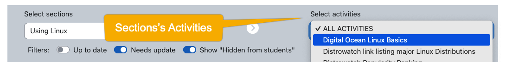
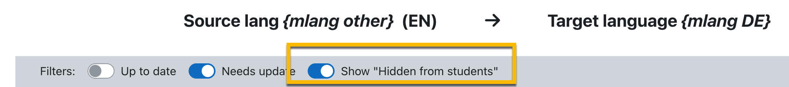

### Status Indicators

Every row displays a color-coded status dot so you can quickly monitor translation progress:

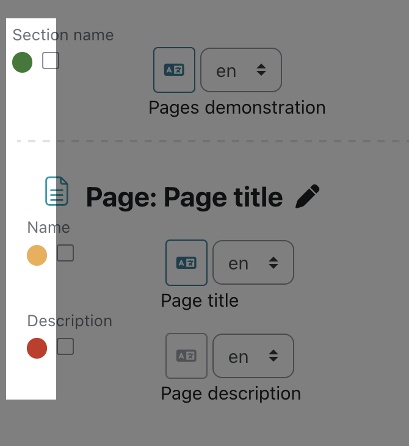

- 🔴 **Red (Not Translated):** The text has no translation in the selected target language.
- 🟢 **Green (Up to Date):** The text has already been translated and the original source has not changed.
- 🟠 **Orange (Needs Update):** The text was previously translated, but the original source content has since been edited in Moodle.

### Rephrasing and Text Improvement

If you have a **DeepL API Pro** account, DeepLer can rephrase existing content to enhance clarity, style, and tone without changing the language.

- Supported languages include English (US/UK), German, French, Spanish, Italian, and Portuguese.
- For English and German, you can fine-tune the desired tone (e.g., formal or casual) in the **Advanced Settings**.

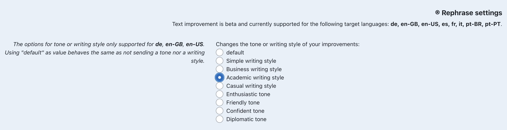

### Image and Media Previews

DeepLer detects embedded images and media within your course content:
- Images are displayed in the preview pane to give translators visual context.
- When an image includes an `alt` description, it is highlighted for easy reference.

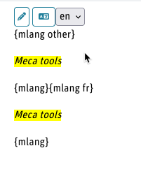

### Formulas and Technical Formatting

DeepLer includes smart safeguards to protect technical and mathematical content:
- **LaTeX Math Formulas:** Formulas enclosed in `$$...$$` can be automatically protected so DeepL does not alter mathematical equations.
- **Code & Preformatted Blocks:** Text inside `<pre>` tags can be preserved intact.
- **Embeds & iFrames:** Toggle iFrame previews on or off to maintain a clean editing layout.

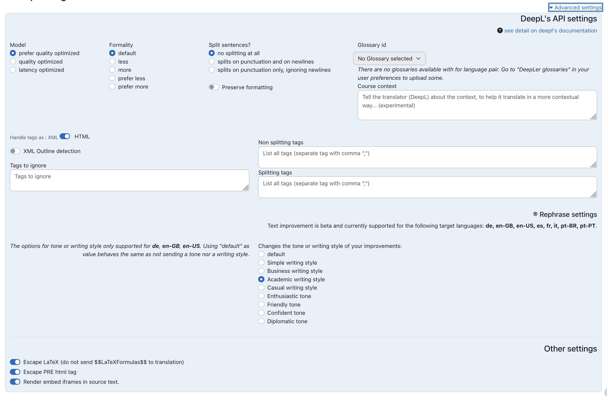

---

## Glossaries (Custom Terminology)

Glossaries ensure that specialized academic terms, brand names, and institutional jargon are always translated consistently and accurately.

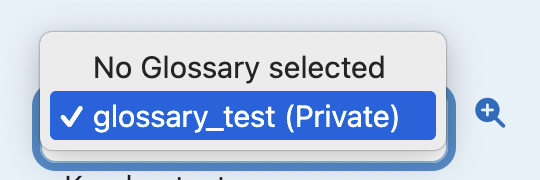

### How Glossaries Work
- Once uploaded, matching glossaries are automatically available in the **Advanced Settings** dropdown whenever you select their language pair.
- You can inspect the terms in any glossary by clicking the magnifying glass icon.

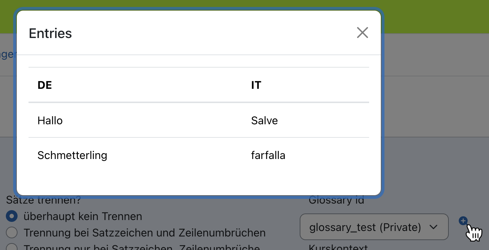

### Creating Your Glossary File

You can upload glossaries in **CSV, TSV, XLSX, XLS, or ODS** formats. Each file should contain **two columns** representing a single direction (Source → Target).

You can specify the language pair in either of two easy ways:

#### Option A: Column Headers
Place the two-letter language codes in the very first row of your spreadsheet:

| EN | FR |
| :--- | :--- |
| course module | module de cours |
| gradebook | carnet de notes |
| quiz | test d'évaluation |

#### Option B: File Naming Convention
Name your file using the pattern `GLOSSARYNAME_SOURCE-TARGET.ext` (with two-letter language codes):
- `MedicalTerms_en-es.xlsx`
- `PhysicsJargon_FR-DE.csv`

### Managing and Sharing Glossaries

Translators and administrators can manage glossaries directly within Moodle:

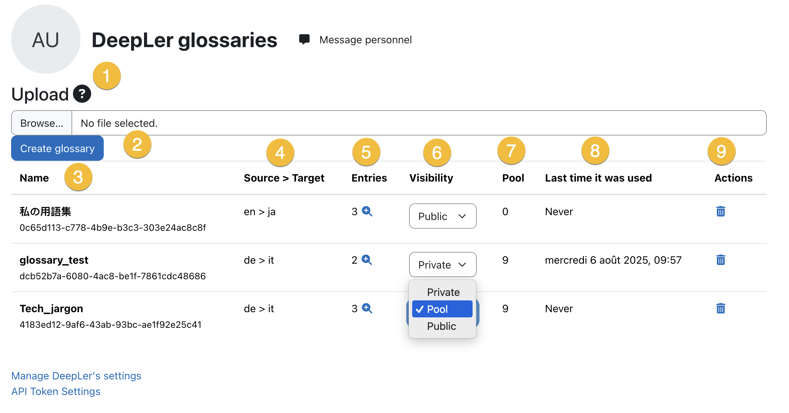

Glossary visibility can be set to:
- **Private:** Visible only to the user who uploaded it.
- **Pool:** Shared among a group of translators using the same API token.
- **Public:** Available to all translators across the entire Moodle site (set by administrators).

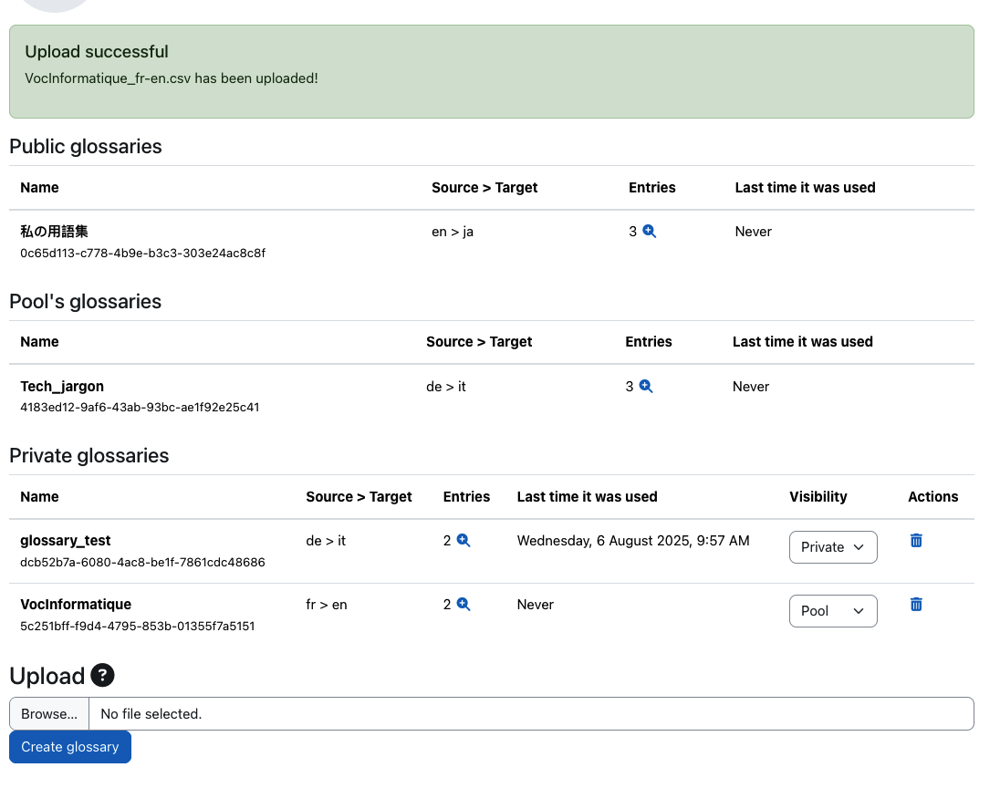

---

## Administrator Configuration

Navigate to **Site Administration → Plugins → Local plugins → DeepL Translator** to configure site-wide preferences.

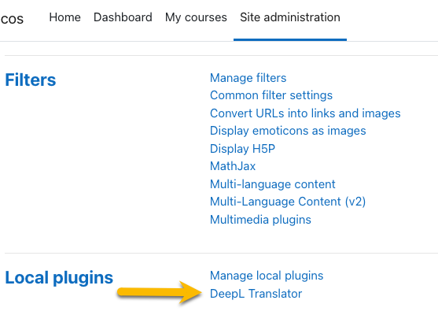

### Main Settings & API Keys

- **DeepL API Key:** Enter your DeepL Free or Pro authentication key.
- **Allow Fallback Key:** When enabled, all translators can use the main system key unless they are assigned a specific token.
- **Default LaTeX / PRE Escaping:** Enable or disable automatic formula protection by default.
- **Minimum Textfield & DB Limits:** Sets safety thresholds to prevent database character overflow on short text fields.

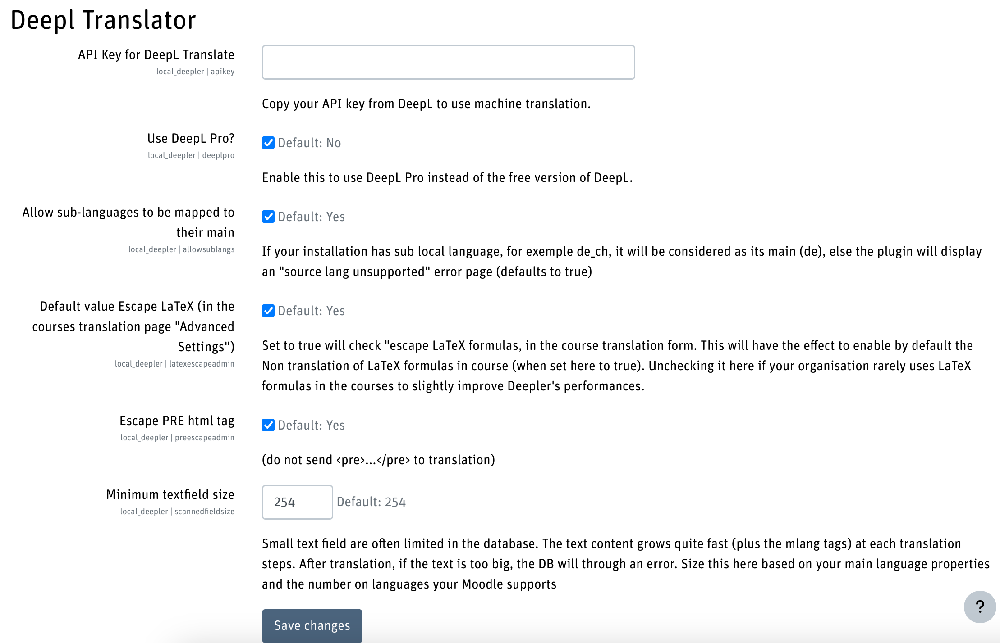

### Token Manager (Multi-User API Keys)

To control costs or allocate API usage across different departments, administrators can map specific users or roles to separate DeepL API tokens.

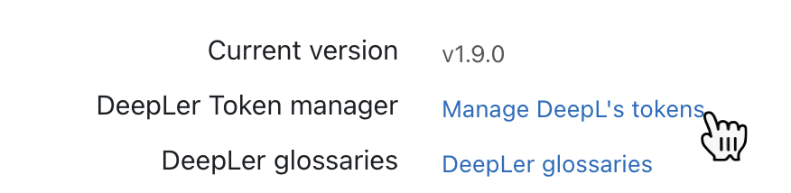
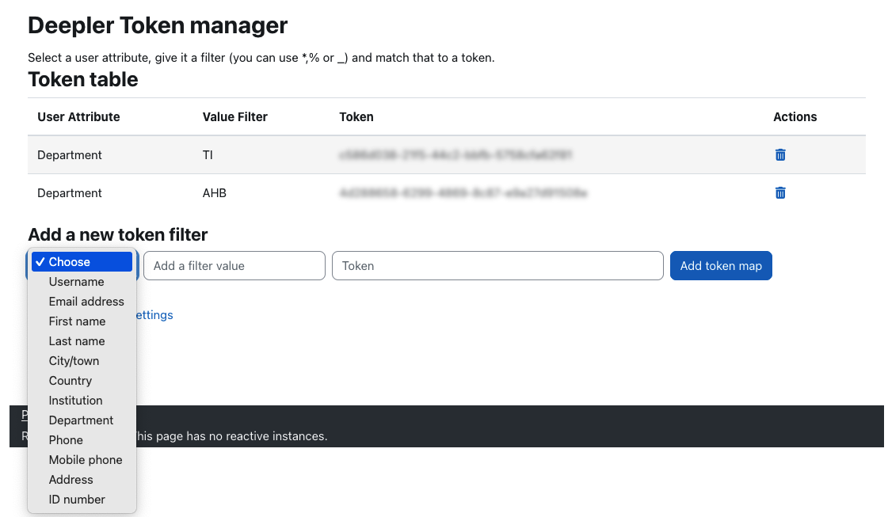

1. Navigate to the **Token Manager** tab.
2. Define a rule matching a user profile field (such as department or institution).
3. Assign the corresponding DeepL API key.

### User Capabilities & Permissions

DeepLer provides the capability:
```text
local/deepler:edittranslations
```
Assign this capability to teacher roles, course creators, or a dedicated **Translator** role to grant access to the translation interface.

### Additional Field Configuration (Advanced JSON)

DeepLer automatically detects all standard Moodle activities, resources, and question types. 

If your site uses **custom 3rd-party plugins or unique question types**, administrators can easily expose their database fields for translation through the **Additional field configuration (JSON)** setting without modifying any code.

```json
{
  "mod_customactivity": {
    "customactivity": {
      "fields": {
        "name": null,
        "intro": null,
        "customnotice": null
      }
    }
  }
}
```

- Set `"editable": false` to show a field as read-only reference.
- Set `"exclude": "*"` to skip specific values or fields.
- The configuration is validated automatically upon saving to prevent database errors.

---

## Tips & Best Practices for Course Creators

- **Establish Source Language First:** Always write your original course materials in your primary language before starting the translation process.
- **Review High-Stakes Assessments:** While DeepL provides high-accuracy translations, always have an educator review translated quiz questions and answer options for pedagogical nuances.
- **Take Advantage of User Tours:** Administrators can enable Moodle User Tours (`tourguide/tour_export.json`) to provide new translators with an interactive, on-screen walkthrough.
- **Monitor Character Limits:** When translating concise titles or short field labels, keep an eye on database length warnings to avoid text truncation.

---

## Compatibility

- **Moodle Versions:** Moodle 4.1 through 5.2+
- **PHP Support:** PHP 8.1 to 8.4
- **Text Editors:** Fully compatible with **TinyMCE** (Moodle default) and standard textarea editors.
- **Themes:** Fully tested with **Boost**, **Classic**, and child themes.

---

## Contributing & Development

We welcome feedback, bug reports, and community contributions!

- **Issue Tracker & Feature Requests:** [GitHub Issues](https://github.com/brunobaudry/moodle-local_deepler/issues)
- **Contribution Guidelines:** See [CONTRIBUTING.md](CONTRIBUTING.md) for pull request guidelines and coding standards.
- **Automated Testing:** PHPUnit and Behat test suites are configured for continuous integration. For local testing with your API key, copy `.env-dist` to `.env` and configure `DEEPL_API_TOKEN`.

---

*DeepLer is an open-source Moodle plugin distributed under the GNU General Public License (GPL-3.0).*
