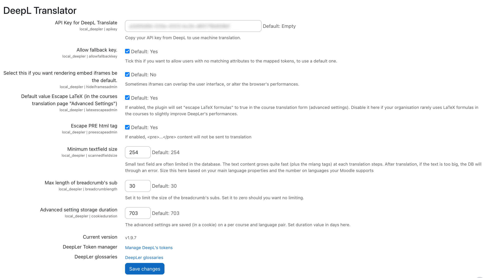
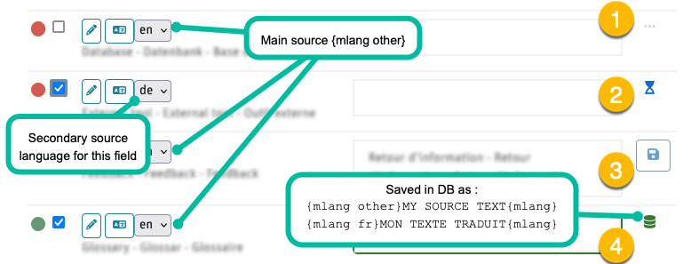

# Deepler, Multilang Machine Translator for Moodle

[](https://github.com/brunobaudry/moodle-local_deepler/actions/workflows/moodle-ci.yml) [](https://github.com/brunobaudry/moodle-local_deepler/actions/workflows/dependency-review.yml)
[](https://sonarcloud.io/summary/new_code?id=brunobaudry_moodle-local_deepler) [](https://sonarcloud.io/summary/new_code?id=brunobaudry_moodle-local_deepler)

Deepler is a local Moodle plugin that provides automatic machine translation using the ©DeepL Pro Translation api.
It is developed for those who want to translate a course all on one page,
without having to navigate to each module and update manually translations and the {mlang} tags.
Translation workflow being the following:

1. Set Moodle current language as your source language. 
0. Fine tune your ©DeepL's settings.
2. Select the target language.
3. Select the fields to translate and if need different source than the current main (Moodle's).
4. Send to ©DeepL.
5. Review and or amend automated translations.
6. Save translations to Moodle's DB (with the multilang {mlang XX} tags).
7. Your course is multilingual.
8. ...

[Multi-Language Content (v2)](https://moodle.org/plugins/filter_multilang2) is a dependency of this plugin and will not work without it.


# Table Of Content

<!-- toc -->

- [Installation](#installation)
  * [Dependencies](#dependencies)
- [Configuration](#configuration)
  * [Permissions (Moodle capability)](#permissions-moodle-capability)
  * [Admin](#admin)
    + [Default value Escape LaTeX (in the courses translation page "Advanced Settings")](#default-value-escape-latex-in-the-courses-translation-page-advanced-settings)
    + [Default value Escape PRE (in the courses translation page "Advanced Settings")](#default-value-escape-pre-in-the-courses-translation-page-advanced-settings)
    + [Minimum textfield size](#minimum-textfield-size)
- [Translating](#translating)
  * [Advanced settings](#advanced-settings)
    + [Deepl API setting](#deepl-api-setting)
    + [Other setting](#other-setting)
  * [Language selection](#language-selection)
    + [Deepl language list vs Moodle's](#deepl-language-list-vs-moodles)
    + [Source language](#source-language)
    + [Target language](#target-language)
    + [Unsupported](#unsupported)
  * [Header](#header)
  * [Filters](#filters)
    + [Up to date:](#up-to-date)
    + [Needs update:](#needs-update)
  * [Status indicator](#status-indicator)
  * [Translation process](#translation-process)
    + [Editing the source](#editing-the-source)
    + [Reviewing past translations and multilang's tags](#reviewing-past-translations-and-multilangs-tags)
    + [Images and medias.](#images-and-medias)
  * [Performing translations](#performing-translations)
  * [Modules](#modules)
- [User tour (inline tutorial)](#user-tour-inline-tutorial)
- [WARNINGS](#warnings)
  * [Complex modules/activities structures.](#complex-modulesactivities-structures)
  * [Multi mlang xx tags inside a field](#multi-mlang-xx-tags-inside-a-field)
  * [Image display and image alt attributes](#image-display-and-image-alt-attributes)
- [Compatibility](#compatibility)
  * [Moodle's versions](#moodles-versions)
  * [Editors](#editors)
  * [Coding](#coding)
  * [Webservices](#webservices)
- [How does this plugin differs from Content Translation Manager and Content Translation Filter?](#how-does-this-plugin-differs-from-content-translation-manager-and-content-translation-filter)
- [Future (todos)](#future-todos)
- [Submit an issue](#submit-an-issue)
- [Changelog](#changelog)
- [Coding, Debugging and Contributing](#coding-debugging-and-contributing)
  * [Admin settings.](#admin-settings)
  * [Contribute to this code base](#contribute-to-this-code-base)
    + [Adding feature request or reporting defects](#adding-feature-request-or-reporting-defects)
    + [Pull requests](#pull-requests)
  * [PHPUNIT and BEHAT](#phpunit-and-behat)
    + [Github Moodle CI Actions](#github-moodle-ci-actions)
- [Fork](#fork)

<!-- tocstop -->

## Installation

Clone or [download](https://github.com/brunobaudry/moodle-local_deepler/releases) this plugin to ```/moodlewww/local/deepler``` and run through the database
upgrade process.

### Dependencies

You need a [©DeepL API](https://www.deepl.com/en/pro-api)  Free or Pro account.
[Multi-Language Content (v2)](https://moodle.org/plugins/filter_multilang2) is a dependency of this plugin and will not work without it.

## Configuration
see [Coding, Debugging and Contributing](#coding-debugging-and-contributing) if you intend to help improving this plugin, or just if you are an admin and want to do some test in a dedicated sandbox.

### Permissions (Moodle capability) 

Course Translator will extend Moodle with the ```local/deepler:edittranslations``` capability. Assign the capability to a new Translator role or add it to one of your
existing roles.
The context for this capability is set to USER so that you can also assign it to a user directly (provided it will have capabilities to access the course and modules).

### Admin

To configure the plugin, navigate to **Site Administration -> Plugins -> Local plugins -> Manage local plugins.** From this page you can configure ©DeepL settings, specify wether
you are using ©DeepL API Free or ©DeepL API Pro. Visit
the [©DeepL API page](https://developers.deepl.com/docs/getting-started/readme) to
signup for an api key that you can enter into local plugin settings.

#### Default value Escape LaTeX (in the courses translation page "Advanced Settings")

Set to true will check "escape LaTeX formulas", in the course translation form. This will have the effect to enable by default the Non translation of LaTeX formulas in course (when
set here to true).
Unchecking it here if your organisation rarely uses LaTeX formulas in the courses to slightly improve Deepler's performances,

#### Default value Escape PRE (in the courses translation page "Advanced Settings")

Do not send &lt;pre&gt;...&lt;/pre&gt; to translation by default.

#### Minimum textfield size

Small text field are often limited in the database. The text content grows quite fast (plus the mlang tags) at each translation steps.
After translation, if the text is too big, the DB will through an error.

Size this here based on your main language properties and the number on languages your Moodle supports



## Translating

To begin translating content, visit a course, open the course settings action menu, and then go to **Course Translator**.


You will be sent to the translation page for the course.

### Advanced settings

#### Deepl API setting

There you can fine tune [©DeepL's commands](https://developers.deepl.com/docs).
Usually the default as set below should work fine with Moodle activity content.

##### Glossaries
*Glossaries' content have to be sent by other means than this plugin, but it is in our todo list to add an interface for that here.*
DeepL's Glossary ID's are saved by course id + source<7target lang pairs. 

#### Other setting

##### Escape LaTeX and or PRE tags

Because Deepl is not very Good at that, iow we experienced that it would behave with inconsistency.
When this is set, Deepler will seek $$...$$ string, replace by a token, send to Deepl to translate and replace back the LaTeX formulas
upon return.
This setting's default in the editor can be set in the plugin [admin page](#admin).


### Language selection

#### Deepl language list vs Moodle's

Deepl API language portfolio differs from Moodle language packs.

Currently Deepl doesn't support sub language for source lanagues.
See https://developers.deepl.com/docs/resources/supported-languages.

But forces sub languages for targets with :
- EN-GB - English (British)
- EN-US - English (American)
- PT-BR - Portuguese (Brazilian)
- PT-PT - Portuguese (all Portuguese variants excluding Brazilian Portuguese)
- ZH-HANS - Chinese (simplified)
- ZH-HANT - Chinese (traditional)

If your installation has sub local language, for example de_ch, it will be considered as its main (de).

So the plugin behaviour is the following :
The proposed source languages will main languages of your Moodle instance lang list.
The proposed targets will be all you available languages if they have a main Deepl compatible main language and the matching sub languages.
But will then save it as the main language in the DB.

For example if you have a EN package you will be able to choose either EN-GB or EN-US as your target language, but it will save it as {mlang en}

Make sure you set the correct multilangv2 setting for that matter. 

_It would make sense to allow you, from the interface, to map to which sub language you wish to save your translation.
Let us know if this is a real need by submitting a GITHUB issue._

#### Source language

**The source language will be set to the actual Moodle language** selection, which will automatically set it as the **other** fallback language.

*nb: In a future release you'll be able to assign the **other** fallback language to your choosing for more flexibility*.

To change the source language you'd change Moodle's lang.
It is important, from a translation standpoint, to **select the source language from the language it was initially written** (and to stick with it).

When first translating your content the plugin will insert ```{mlang other}Your Content...{mlang}``` tags .
Please checkout the [mlang docs](https://moodle.org/plugins/filter_multilang2) if you are not familiar with Moodle's MLANG concept more.


#### Target language

To change the language you want to translate to, choose a language from the **Target language {mlang XX}** dropdown.
Note: indeed you cannot translate from and to the same language so buttons and checkboxes would be disabled if so.

#### Unsupported

Language that are not supported by ©DeepL are checked at each session so if your Moodle instance have unsupported languages, you will not be able to select it.


### Header


### Filters

You can filter the rows to hide/show the ones that need to be translated as wished.
Clicking on the "Status" checkbox will select all visible.

These filter show/hide the textual content found in the course.

#### Up to date:

These are the content that are already translated and that no change were made in the source.

They will appear with the GREEN DOT indicator.

#### Needs update:

These are the textual contents that were never translated or that were modified after being translated.

They appear with the RED DOT indicator when they were never translated.

They appear with the ORANGE DOT indicator when they were already translated but the source text change since.

### Status indicator


Each row has a little colored dot to indicate a status:

- Red -> This field was never translated. (no {mlang xx} tag for the xx target language found)
- Green -> The filed was already translated and up to date (in the target language).
- Orange -> This field was translated but there were some updates made in the Database. (Needs a review)

### Translation process

#### Editing the source

It is not possible to edit the source content from this plugin's interface.
Nevertheless, clicking on the PENCIL icon will jump you to the regular place for you to do so.


#### Reviewing past translations and multilang's tags

Clicking on the TRANSLATION icon will toggle the display of multilang tags and all available translations.


#### Images and medias.

The plugin will try to fetch and display embedded images. (this should be improved soon so that image are displayed in the source)
When not found it will highlight the alt text in yellow and italicised as seen above.


### Performing translations



1. The text is not selected. No translation will occur. ( ... )
2. The text is selected but not sent to ©DeepL yet. (hourglass)
    1. By default, the main source language is selected. It will be stored within {mlang other}* tag.
    2. You set another language as source if your content had some content written in different lang. It will be stored within {mlang xx}* tag.
3. Translation is retrieved from ©DeepL and filed in the text editor. (floppy)
    1. Now the translator can review ©DeepL's work and amend the translation if necessary.
    2. Once happy with the content a click on the floppy button will save the text.
          
       (Save all saves all selected translations by batch)
4. Translation is saved in the database, with the {mlang} filter surrounding it. (DB icon)

_Note* the following process when saving to the database _

The original content **has no MLANG tag** and the source lang is the main:

`{mlang other}SOURCE_CONTENT{mlang} {mlang target_lang}TRANSLATED_CONTENT{mlang}`

The original content **has no MLANG tag** and the source lang is different from the main:

`{mlang other}SOURCE_CONTENT{mlang} {mlang special_source_lang}SOURCE_CONTENT{mlang} {mlang target_lang}TRANSLATED_CONTENT{mlang}`

The original content **has already MLANG tag** and the source lang is the main:

`{mlang other}SOURCE_CONTENT{mlang} {mlang target_lang}TRANSLATED_CONTENT{mlang}`

The original content **has already MLANG tag** and the source lang is different from the main and there were **no {mlang other}**:

`{mlang other}SOURCE_CONTENT{mlang} {mlang special_source_lang}SOURCE_CONTENT{mlang} {mlang target_lang}TRANSLATED_CONTENT{mlang}`

The original content **has already MLANG tag** and the source lang is different from the main and there were **already a {mlang other**:

`{mlang other}ANOTHER_SOURCE{mlang} {mlang special_source_lang}SOURCE_CONTENT{mlang} {mlang target_lang}TRANSLATED_CONTENT{mlang}`

### Modules


Content's texts fields are displayed in the order of appearance of the course.
A module (course settings, topics etc.) separator corresponding to the activities grouping is displayed with its title,
underneath you can see it available for translation.

_Note that: for now, the naming of the instances as well ads the fields are the DB ones,
it will soon be replaced by the one used in Moodle's course layout for a better usability._

## User tour (inline tutorial)

You can install a [tour guide](https://github.com/brunobaudry/moodle-local_deepler/blob/main/tourguide/tour_export.json) to simplify your translators' trainings.

See Moodle's instructions here : [User tours](https://docs.moodle.org/31/en/User_tours)

## WARNINGS

### Complex modules/activities structures.

Activities/resources with complex sub content may not all work.
We currently plan to support all the core mods and would be happy to add more (send us a PR)
Book does, wiki too but beware when translating [[links]] as it will break the page link. (this should be fixed in future releas)

### Multi mlang xx tags inside a field

At this time, Deepler does not have the ability to translate advanced usage of mlang in content. For example, this includes the use of multiple mlang tags spread
throughout content that utilize the same language._

**Note**: Still you can add untranslated content, after a first insertion of mlang tags, before and/or after, the parser should then leave them in place.

### Image display and image alt attributes

Currently, images are only displayed in the preview but not in the text editor. Instead, the alt attribute content is highlighted.
The Alt attribute is not sent to ©DeepL. This should be added in further improvement for better accessibility.

## Compatibility

### Moodle's versions

This plugin has been tested on Moodle 4.1+
php >= 8.1

### Editors
Should work with the following editors:

- Plaintext
- Atto
- Tiny°
- Marklar

°Tiny editor has an autosave function by default. This can be annoying/puzzling when you switch languages and see the previous language cached in the textarea.
Until we find a satisfying way to disable that behaviour from the plugin. As a Moodle admin disabling *AutoSave* from Admin>Plugins>Text-Editors>TinyMCE>General settings.


### Coding

It uses the default Moodle JS library and is tested with Boost and Classic.
So there could be incompatibilities with other themes.

see [Coding, Debugging and Contributing](#coding-debugging-and-contributing) should you intend to help improving this plugin or just should you be an admin and want to do some 
test in a dedicated sandbox.

### Webservices

This plugin will add a ```local_deepler_update_translation``` web service for the translation page to perform ajax requests against.

## How does this plugin differs from Content Translation Manager and Content Translation Filter?

This plugin does not translate every string on your site. It is only meant for translating courses and Questions. It uses Moodle's built-in multilingual features along with ```{mlang}``` to
translate your content. When you backup and restore courses, your translations will migrate with your content. Updating your source content will provide a "Update Needed" status
message on the course translation page.

## Future (todos)

- Machine translation API abstraction to use other services than ©DeepL.
- Display images all times.
- Translations versioning.
- Import glossaries.
- Multiple API key setting and user mapping.
- Document translation.

## Submit an issue

Please [submit issues here.](https://github.com/jamfire/moodle-local_deepler/issues)

## Changelog

See the [CHANGES.md](CHANGES.md) documentation.

## Coding, Debugging and Contributing

### Admin settings.
This plugin relies on javascript. So if you set test environment with Moodle's debugging features,
make sure **debugdisplay** (Display debug messages) is set to 'No'.
This because as  **debugdisplay** breaks the xhtml. So message from elsewhere could break the process.

On the other hand with **debug** (Debug messages) there is already a comprehensive messaging that should inform you what is going wrong with the plugin's process.
Depending on the level DEVELOPPER, ALL, NORMAL, MINIMAL or NONE, the plugin's debugging messages adapt to it.

Check your browser's dev tools (F12) to see the detailed logs.

### Contribute to this code base

#### Adding feature request or reporting defects
https://github.com/brunobaudry/moodle-local_deepler/issues

Make sure you describe:
- Your environment (PHP, Moodle version, database, browser used etc.)
- The current behaviour.
- The expected behaviour.

Pull requests, adhering to [Moodle's coding guidelines](https://moodledev.io/general/development/policies/codingstyle), are welcome !

#### Pull requests
See the [CONTRIBUTING.md](CONTRIBUTING.md) default documentation, for how-to with GIT and github and push some code.

### PHPUNIT and BEHAT

This plugins tries to have descent testing setup.

Some additional PHPUNIT, as well as BEHAT test can run be done provided you have a valid key.
rename .env-dist to .env and set there your own api key
**DEEPL_API_TOKEN=DEFAULT** **DEEPL_API_TOKEN=YOUR_OWN_DEEPL_API_KEY**
(You can add both a pro or a free key, we recommend that you do the tests with a free one).

#### Github Moodle CI Actions 
If you intend to test in your forked repo this code with Moodle CI.
Ensure you also add a **Repository secret** with the **DEEPL_API_TOKEN** (as with the .env)
(Repo > Settings > Security > Secrets and variable > Actions > New repository secret)

## Fork

Originally a fork of Jamfire's https://github.com/jamfire/moodle-local_coursetranslator, this plugin had lots of refactoring and UI changes.
Should you prefer a fully automated Deepl translation. Checkout Jamfire's replacement plugin :

https://github.com/jamfire/moodle-filter_autotranslate
It is text filter, most probably the best way for fast auto-translation (populating the result without intervention), we found useful to improve this one adding the necessary 
"revision" step as Machine translation will never be 100% accurate specially in the context of knowledge transmission where accuracy is mandatory.
