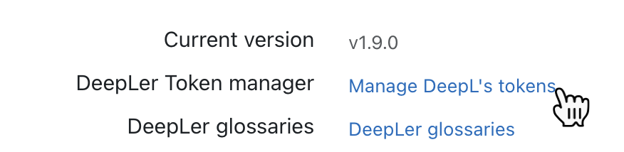
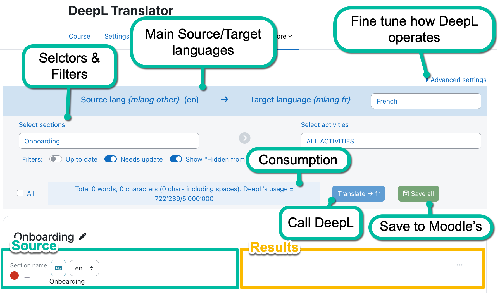
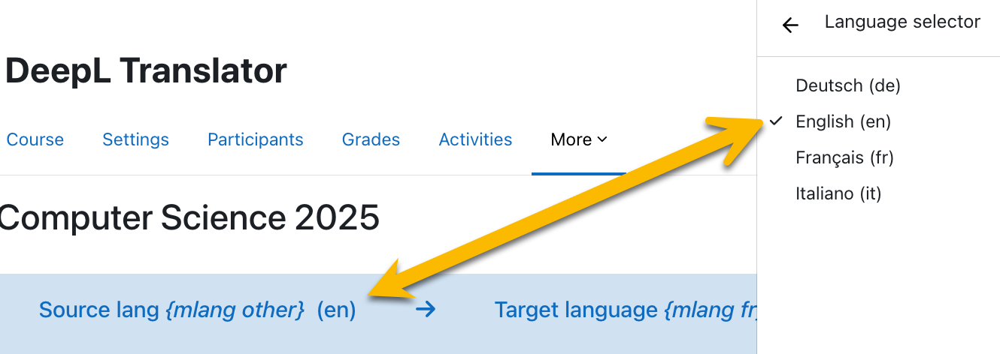
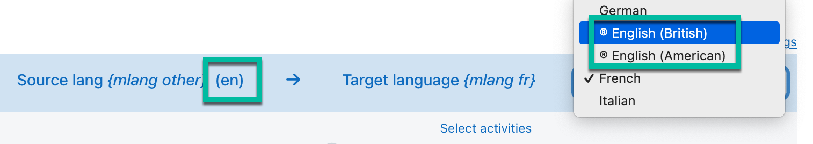
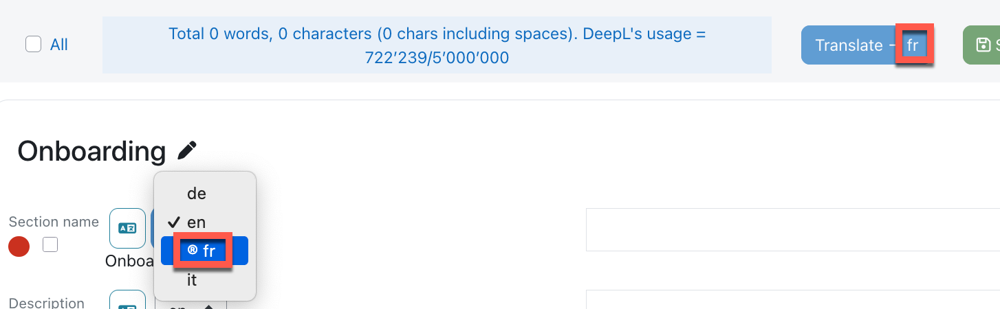
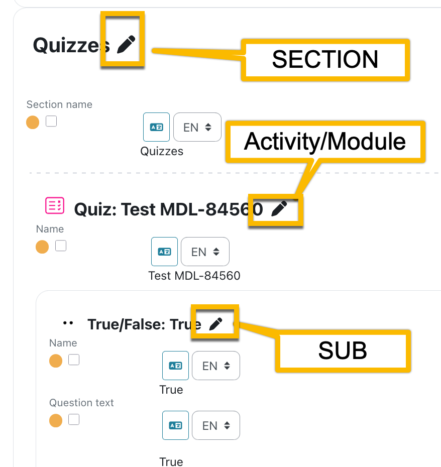
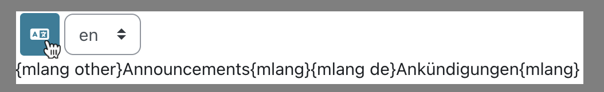

# Deepler, Multilang Machine Translator for Moodle

[](https://github.com/brunobaudry/moodle-local_deepler/actions/workflows/moodle-ci.yml)
[](https://github.com/brunobaudry/moodle-local_deepler/actions/workflows/moodle-ci.yml)
[](https://github.com/brunobaudry/moodle-local_deepler/actions/workflows/moodle-ci.yml)
[](https://sonarcloud.io/summary/new_code?id=brunobaudry_moodle-local_deepler) 
[](https://sonarcloud.io/summary/new_code?id=brunobaudry_moodle-local_deepler)
[](https://github.com/brunobaudry/moodle-local_deepler/blob/main/LICENSE)

DeepLer is a local Moodle plugin that provides automatic machine translation or text improvement (not available with ©DeepL free api accounts) using the ©DeepL Pro Translation api.

It is developed for those who want to translate or rephrase a course all on one page,
without having to navigate to each module and update manually translations and the {mlang} tags.
Translation workflow being the following:

1. Upload your prefered terminologies (DeepL glossaries)
2. Set Moodle current language as your source language. 
0. Fine tune your ©DeepL's settings.
2. Select the target language.
3. Select the fields to translate and if need different source than the current main (Moodle's).
4. Send to ©DeepL.
5. Review and or amend automated translations.
6. Save translations to Moodle's DB (with the multilang {mlang XX} tags).
7. Your course is multilingual.
8. ...


[Multi-Language Content (v2)](https://moodle.org/plugins/filter_multilang2) is a dependency of this plugin and will not work without it.


# Table Of Content

<!-- toc -->

- [Installation](#installation)
  * [Dependencies](#dependencies)
- [Configuration](#configuration)
  * [Permissions (Moodle capability)](#permissions-moodle-capability)
  * [Main Admin settings](#main-admin-settings)
      - [API Key for DeepL Translate - Allow Fallback key.](#api-key-for-deepl-translate---allow-fallback-key)
      - [Tell the browser not to render embed iframes by default.](#tell-the-browser-not-to-render-embed-iframes-by-default)
      - [Default value Escape LaTeX (in the courses translation page "Advanced Settings")](#default-value-escape-latex-in-the-courses-translation-page-advanced-settings)
      - [Default value Escape PRE (in the courses translation page "Advanced Settings")](#default-value-escape-pre-in-the-courses-translation-page-advanced-settings)
      - [Minimum textfield size](#minimum-textfield-size)
      - [Max length of breadcrumb's sub](#max-length-of-breadcrumbs-sub)
    + [Additional admin pages for Token management and Glossaries.](#additional-admin-pages-for-token-management-and-glossaries)
  * [Token manager (mapping user to DeepL's API keys)](#token-manager-mapping-user-to-deepls-api-keys)
- [Glossaries' management (NEW since v1.9)](#glossaries-management-new-since-v19)
  * [Overview](#overview)
  * [File formats to upload.](#file-formats-to-upload)
  * [Rules-Process](#rules-process)
    + [File naming conventions:](#file-naming-conventions)
    + [Spreadsheet headers for language pair detection.](#spreadsheet-headers-for-language-pair-detection)
    + [Examples](#examples)
      - [FR > ES (file naming conventions)](#fr--es-file-naming-conventions)
      - [ES > FR (using headers)](#es--fr-using-headers)
      - [File naming convention examples :](#file-naming-convention-examples-)
  * [Admin glossaries](#admin-glossaries)
    + [Steps](#steps)
      - [1. Review the instructions (optional)](#1-review-the-instructions-optional)
      - [2. Select and upload](#2-select-and-upload)
      - [3. Name and Glossary ID](#3-name-and-glossary-id)
      - [4. Source > Target](#4-source--target)
      - [5. Entries](#5-entries)
      - [6. Visibility](#6-visibility)
      - [7. Pool](#7-pool)
      - [8. Last time it was used](#8-last-time-it-was-used)
      - [9. Actions](#9-actions)
  * [Users' glossaries](#users-glossaries)
    + [Public and Pool glossaries](#public-and-pool-glossaries)
    + [Private glossaries](#private-glossaries)
- [Translating](#translating)
  * [Advanced settings](#advanced-settings)
    + [Deepl API setting](#deepl-api-setting)
      - [Glossaries (NEW since v1.9)](#glossaries-new-since-v19)
      - [®Rephrase](#%C2%AErephrase)
    + [Other setting](#other-setting)
      - [Escape LaTeX and or PRE tags](#escape-latex-and-or-pre-tags)
      - [Tell the browser not to render embed iframes.](#tell-the-browser-not-to-render-embed-iframes)
    + [Cookie](#cookie)
  * [Language selection](#language-selection)
    + [Deepl language list vs Moodle's](#deepl-language-list-vs-moodles)
    + [Source language](#source-language)
    + [Target language](#target-language)
    + [® Rephrasing (text improvement)](#%C2%AE-rephrasing-text-improvement)
    + [Unsupported languages](#unsupported-languages)
  * [Header](#header)
  * [Filters](#filters)
    + [Sections and activities selections](#sections-and-activities-selections)
    + [Up to date filter:](#up-to-date-filter)
    + [Needs update filter:](#needs-update-filter)
    + [Hidden:](#hidden)
  * [Breadcrumbs](#breadcrumbs)
  * [Status indicator](#status-indicator)
  * [Translation process](#translation-process)
    + [Editing the source](#editing-the-source)
    + [Reviewing past translations and multilang's tags](#reviewing-past-translations-and-multilangs-tags)
      - [List of mlang tags for each field](#list-of-mlang-tags-for-each-field)
    + [Images and medias.](#images-and-medias)
  * [Performing translations](#performing-translations)
    + [Field size warning (DB max char)](#field-size-warning-db-max-char)
    + [Saving to sub-languages](#saving-to-sub-languages)
  * [Structure](#structure)
- [User tour (inline tutorial)](#user-tour-inline-tutorial)
- [WARNINGS](#warnings)
  * [Complex modules/activities structures.](#complex-modulesactivities-structures)
  * [Multi mlang xx tags inside a field](#multi-mlang-xx-tags-inside-a-field)
  * [Image display and image alt attributes](#image-display-and-image-alt-attributes)
- [Compatibility](#compatibility)
  * [Moodle's versions](#moodles-versions)
  * [Editors](#editors)
  * [Coding](#coding)
  * [Webservices](#webservices)
- [How does this plugin differs from Content Translation Manager and Content Translation Filter?](#how-does-this-plugin-differs-from-content-translation-manager-and-content-translation-filter)
- [Future (todos)](#future-todos)
- [Submit an issue](#submit-an-issue)
- [Changelog](#changelog)
- [Coding, Debugging and Contributing](#coding-debugging-and-contributing)
  * [Admin settings.](#admin-settings)
  * [Contribute to this code base](#contribute-to-this-code-base)
    + [Adding feature request or reporting defects](#adding-feature-request-or-reporting-defects)
    + [Pull requests](#pull-requests)
  * [PHPUNIT and BEHAT](#phpunit-and-behat)
    + [Github Moodle CI Actions](#github-moodle-ci-actions)

<!-- tocstop -->

## Installation

Clone or [download](https://github.com/brunobaudry/moodle-local_deepler/releases) this plugin to ```/moodlewww/local/deepler``` and run through the database
upgrade process.

### Dependencies

You need a [©DeepL API](https://www.deepl.com/en/pro-api)  Free or Pro account when you want to translate your content from one source to a distinct target.
You need a [©DeepL API Improve text](https://developers.deepl.com/docs/api-reference/improve-text) **Pro** account should your need be to rephrase your source in the same language.
[Multi-Language Content (v2)](https://moodle.org/plugins/filter_multilang2) is a dependency of this plugin and will not work without it.


## Configuration
see [Coding, Debugging and Contributing](#coding-debugging-and-contributing) if you intend to help improving this plugin, or just if you are an admin and want to do some test in a dedicated sandbox.

### Permissions (Moodle capability) 

Course Translator will extend Moodle with the ```local/deepler:edittranslations``` capability. Assign the capability to a new Translator role or add it to one of your
existing roles.
The context for this capability is set to USER so that you can also assign it to a user directly (provided it will have capabilities to access the course and modules).

### Main Admin settings
To configure the plugin, navigate to **Site Administration -> Plugins -> Local plugins -> DeepL Translator.**


From this page you can configure ©DeepL settings, specify wether
you are using ©DeepL API Free or ©DeepL API Pro. Visit
the [©DeepL API page](https://developers.deepl.com/docs/getting-started/readme) to
signup for an api key that you can enter into local plugin settings.

##### API Key for DeepL Translate - Allow Fallback key.

The main API key now can be used for all users if you do tick **Allow fallback key**

If you untick *Allow fallback key* than a user must have an attribute mapped to a token in the **Token manager**

##### Tell the browser not to render embed iframes by default.
Sometimes iframes can overlap the user interface toggle this to show/hide all iframes in the source text display.

##### Default value Escape LaTeX (in the courses translation page "Advanced Settings")

Set to true will check "escape LaTeX formulas", in the course translation form. This will have the effect to enable by default the Non translation of LaTeX formulas in course (when
set here to true).
Unchecking it here if your organisation rarely uses LaTeX formulas in the courses to slightly improve Deepler's performances,

##### Default value Escape PRE (in the courses translation page "Advanced Settings")

Do not send &lt;pre&gt;...&lt;/pre&gt; to translation by default.

##### Allow bet languages

Workaround to Allow "beta languages". DeepL API https://developers.deepl.com/api-reference/languages/retrieve-supported-languages does not (yet) return the full language
list that it supports https://developers.deepl.com/docs/getting-started/supported-languages ... Those missing languages are now added hardcoded in the plugin.


##### Minimum textfield size

Small text field are often limited in the database. The text content grows quite fast (plus the mlang tags) at each translation steps.
After translation, if the text is too big, the DB will through an error.

Size this here based on your main language properties and the number on languages your Moodle supports.

##### Max length of breadcrumb's sub

The plugin adds a little breadcrumb when you scroll down the translation page. As some titles can be lengthy you can set a max length for each breadcrumb sub.
Set to zero if you'd prefer no limiting.


#### Additional admin pages for Token management and Glossaries. 

### Token manager (mapping user to DeepL's API keys)

DeepL API allows you to generate several API keys mainly for cost control and reporting.

To map, You need to save a main API key/token first, then the additional page links will display:


1. Select a User attribute.
2. Add a simple filter (* % and _ wild cards can be used).
3. Add it to the list.

Now a user having the required capability, when translating a course will get affected a token.


## Glossaries' management (NEW since v1.9)

### Overview
Glossaries are added to your Moodle instance in 3 different ways:
- Downloaded from your DeepL API account.
  - The plugin will synchronise the glossaries automatically.
    - If a Glossary is added via DeepL.com's UI, then it will be added to Moodle. 
    - Should you delete a Glossary via the DeepL.com the plugin will delete it from the plugin upon admin visting the plugin page? So it might be better to only Delete 
      glossary from the plugin and not from DeepL's UI.
  - Admin can make these Glossaries 'public' meaning every translator will be able to use them.
- Uploaded by Moodle admins.
  - Admin can make these Glossaries 'public' meaning every translator will be able to use them.
  - Once uploaded they will be just as the ones downloaded from DeepL.
- Uploaded by translators via their user's preferences.
  - Can be made available to the translators in the same pool (sharing the same token as seen above).
  - Can be kept private (only available to the translator that uploaded it).

### File formats to upload.
You can upload glossaries in the following formats 'csv', 'tsv', 'xlsx', 'xls', 'ods' 

### Rules-Process

Bidirectional glossaries are not allowed yet.

The spreadsheet must contain a single sheet with 2 columns and either (1):

- Valid 2-letter code column headers (expl EN and JA) in upper or lowercase letters.
- Valid file name following the conventions below.

(1)_The file naming has priority.
So if you want to use the header way and add the lang pairs in the file name,
make sure the name has no suffixe like \_SOURCE-TARGET, avoid using a '\_' folowed by a '-'.
Do something like GLOSSARYNAME-SOURCE-TARGET.EXTENSION for example._

#### File naming conventions:
_This has priority when assigning the Glossary's language pair_.

2.  Rename the GLOSSARYNAME\_SOURCE-TARGET.EXTENSION
4.  Name it meaningfully but not too long (for a nice display in tables).
5.  No header in the csv file.
3.  SOURCE and TARGET in the file name must be 2 character language code.
4. DeepL does not manage bi directional glossaries.

#### Spreadsheet headers for language pair detection.

_(When not using the file naming conventions describde above)_

Simply add valid 2-letter code in the first row of your spreadsheet.

| ES        | FR        |
|-----------|-----------|
| hermosa   | belle     |
| exquisito | delicieux |
| mouse     | mouse     |

| FR        | ES        |
|-----------|-----------|
| belle     | hermosa   |
| delicieux | exquisito |
| mouse     | mouse     |

#### Examples

##### FR > ES (file naming conventions)

**File: 'litérature\_fr-es.csv**'

|           |           |
|-----------|-----------|
| belle     | hermosa   |
| delicieux | exquisito |
| mouse     | mouse     |

##### ES > FR (using headers)
**File: 'literatura-es-francia.csv**'

| ES        | FR        |
|-----------|-----------|
| hermosa   | belle     |
| exquisito | delicieux |
| mouse     | mouse     |

##### File naming convention examples :

**Expl OK**

*   私の用語集**_en-ja.xls**
*   Tech\_jargon**\_FR-ES.CSV**
*   myGlossary**-**en-fr.csv (ok only if it has EN FR header row)

**Expl NOT OK (when not using the headers)**

*   myGlossary**-**en-fr.csv (here it will search for langs in the header row)
*   Tech\_jargon\_**FRA-SPA**.ods (3-letter codes, but will not search for the header row)
*   myHistoricalGlo_fr-es.**txt** (unsupported extension)

### Admin glossaries

Once the admin has set the main api key, 2 additional links will display.


Click on "Deepler glossaries" to manage them.


#### Steps

##### 1. Review the instructions (optional)

Unless you remember it.

##### 2. Select and upload

Select here a file on your file system and upload it.
If the file does not match the conventions, or no lang pair header is found, error messages will display.

Upon successful upload, the Glossary is transmitted to DeepL, its metadata stored in Moodle DB and listed on the same page below.

##### 3. Name and Glossary ID

The first column displays the names of both Glossaries retrieved from DeepL and those uploaded from Moodle:

- The one you gave the CSV file without the suffix.
- The name given when created in DeepL's interface.

Below the name is DeepL's glossary uuid, this is what will be transmitted when calling the translations.

##### 4. Source > Target

Displays the glossary's source and target language.

##### 5. Entries

Clicking on the +magnifier will display all the pairs defined. 

##### 6. Visibility

Here you can set who can use the glossary.

1. Private
   2. Only the user that uploaded it.
   3. Glossaries uploaded via your DeepL.com account have no user, so setting it 'private' would be like disabling it.
4. Pool
   5. All users mapped to a DeepL API token will have access to that glossary (see token management).
   6. Glossaries uploaded via your DeepL.com account are mapped to the main API token (id 0). So only admin or users that are not mapped to a sub token (providing you set 
      "Allow fallback key" to true) will have access to that glossary.
7. Public
   8. Public glossaries are accessible by any user.
   9. Only Admins can set this visibility.

##### 7. Pool

The is the DB id of the token the user that uploaded is affiliated with.
When you set the visibility to 'Pool' all users in mapped to the same token will access the glossary.

##### 8. Last time it was used

Each time a translator uses a Glossary (by selecting it in the advanced settings) a time stamp is stored in DB.
This is usefull mainly to cleanup unused glossaries.

##### 9. Actions

For now only deletion.  
__Deleting a glossary here will delete it from DeepL.com too__

### Users' glossaries
Non admin users, hence translators, can manage their won set of glossaries.


#### Public and Pool glossaries

These are Glossaries shared by the site admin or one of the translators sharing the same API token as the current user.

#### Private glossaries

Are the ones uploaded by the current user.
The **visibility** can be:

- Private: not shared
- Pool: shared with other translators sharing the same token.

## Translating

To begin translating content, visit a course, open the course settings action menu, and then go to **DeepL Translator**.


You will be sent to the translation page for the course.




### Advanced settings

#### Deepl API setting

There you can fine tune [©DeepL's commands](https://developers.deepl.com/docs).
Usually the default as set below should work fine with Moodle activity content.


##### Glossaries (NEW since v1.9)

Glossaries (DeepL's) are managed by the plugin.
**ONLY single source>target glossaries (v2) can be used with the plugin** 

Available glossaries are added to a dropdown list if they match the current language pair.
Once you select a glossary it will be stored in the course/source/target cookie.


Clicking on the magnifier icon will display glossary mappings:


##### ®Rephrase
This is a Pro feature that will rephrase the source text.
__This is not available with the free API key.__

Text improvement is beta and currently supported for the following target languages: 
 - de, 
 - en-GB, en-US, 
 - es, 
 - fr, 
 - it, 
 - pt-BR, pt-PT.
For German and english (de, en-GB and en-US) there are some options to choose from to define the tone or writing style.


#### Other setting

##### Escape LaTeX and or PRE tags

Because Deepl is not very Good at that, iow we experienced that it would behave with inconsistency.
When this is set, Deepler will seek $$...$$ string, replace by a token, send to Deepl to translate and replace back the LaTeX formulas
upon return.
This setting's default in the editor can be set in the plugin [admin page](#admin).

##### Tell the browser not to render embed iframes.
Toggle this to show/hide iframes in the source texts.

#### Cookie
All of the advanced settings are saved by course id + source/target lang pairs in the Cookie for one month (each call for sevices resets it).

### Language selection

#### Deepl language list vs Moodle's

Deepl API language portfolio differs from Moodle language packs.

Currently Deepl doesn't support sub language for source lanagues.
See https://developers.deepl.com/docs/resources/supported-languages.

But forces sub languages for targets with :
- EN-GB - English (British)
- EN-US - English (American)
- PT-BR - Portuguese (Brazilian)
- PT-PT - Portuguese (all Portuguese variants excluding Brazilian Portuguese)
- ZH-HANS - Chinese (simplified)
- ZH-HANT - Chinese (traditional)

If your installation has sub local language, for example de_ch, it will be considered as its main (de).

So the plugin behaviour is the following :
The proposed source languages will main languages of your Moodle instance lang list.
The proposed targets will be all you available languages if they have a main Deepl compatible main language and the matching sub languages.
But will then save it as the main language in the DB.

For example if you have a EN package you will be able to choose either EN-GB or EN-US as your target language, but it will save it as {mlang en}

Make sure you set the correct Multilang-V2 setting for that matter.

#### Source language

**The source language will be set to the actual Moodle language** selection, which will automatically set it as the **other** fallback language.

*nb: In a future release you'll be able to assign the **other** fallback language to your choosing for more flexibility*.

To change the source language you'd change Moodle's lang.
It is important, from a translation standpoint, to **select the source language from the language it was initially written** (and to stick with it).

When first translating your content the plugin will insert ```{mlang other}Your Content...{mlang}``` tags .
Please check out the [mlang docs](https://moodle.org/plugins/filter_multilang2) if you are not familiar with Moodle's MLANG concept more.



#### Target language

To change the language you want to translate to, choose a language from the **Target language {mlang XX}** dropdown.
Note: indeed you cannot translate from and to the same language so buttons and checkboxes would be disabled if so.

#### ® Rephrasing (text improvement)

DeepL API pro account can now use the rephrase feature to improve the source text.

When selecting a target language that is supported and that is the same as the source language, the ® sign will be enabled in front of the target languages.


When you selected a target language and a field has outstanding content in another source language than the ® sign will display in front of the single source.


#### Unsupported languages

Language that are not supported by ©DeepL are checked at each session so if your Moodle instance have unsupported languages, you will not be able to select it.

Also if you have a Free account, you cannot select a same source and target languages.


### Header

 

### Filters

In order to organise your translations, there 2 types filters :
- Course's sections and Activities.
- Translation status.

You can filter the rows to hide/show the ones that need to be translated as wished.
Clicking on the "Status" checkbox will select all visible.
These filter show/hide the textual content found in the course.

#### Sections and activities selections
By **default** the plugin will start by showing the course's settings only as with heavy courses loading all activity text fields in a single page can bloat the browser.


Then you can either display **ALL SECTIONS**


Or select one of your course section and narrow down to an activity.


#### Up to date filter:

These are the content that are already translated and that no change were made in the source.

They will appear with the GREEN DOT indicator.

#### Needs update filter:

These are the textual contents that were never translated or that were modified after being translated.

They appear with the RED DOT indicator when they were never translated.

They appear with the ORANGE DOT indicator when they were already translated but the source text change since.

#### Hidden:

Toggle this filter to show/hide hidden (to users) sections or modules.


### Breadcrumbs


When you scroll down the breadcrumbs status give you an indication on where you are in the course.

_ in the expl below we are editing the 'Question text' field of the multichoice question titled 'Multi choice ABC' of the quiz 'Test MDL-84560' located in the course's 
'Quizzes' section.


### Status indicator


Each row has a little colored dot to indicate a status:

- Red -> This field was never translated. (no {mlang xx} tag for the xx target language found)
- Green -> The filed was already translated and up to date (in the target language).
- Orange -> This field was translated but there were some updates made in the Database. (Needs a review)

### Translation process

#### Editing the source

It is not possible to edit the source content from this plugin's interface.
Nevertheless, clicking on the PENCIL icon will jump you to the regular place for you to do so.



_

#### Reviewing past translations and multilang's tags

Clicking on the TRANSLATION icon will toggle the display of multilang tags and all available translations.




##### List of mlang tags for each field
Hovering the button shows you all the tags/languages already present in the field.


#### Images and medias.

The plugin will try to fetch and display embedded images. (this should be improved soon so that image are displayed in the source)
When not found it will highlight the alt text in yellow and italicised as seen above.


### Performing translations


1. The text is not selected. No translation will occur. ( ... )
2. The text is selected but not sent to ©DeepL yet. (hourglass)
    1. By default, the main source language is selected. It will be stored within {mlang other}* tag.
    2. You set another language as source if your content had some content written in different lang. It will be stored within {mlang xx}* tag.
3. Translation is retrieved from ©DeepL and filed in the text editor. (floppy)
    1. Now the translator can review ©DeepL's work and amend the translation if necessary.
    2. Once happy with the content a click on the floppy button will save the text.
          
       (Save all saves all selected translations by batch)
4. Translation is saved in the database, with the {mlang} filter surrounding it. (DB icon)

_Note* the following process when saving to the database _

The original content **has no MLANG tag** and the source lang is the main:

`{mlang other}SOURCE_CONTENT{mlang} {mlang target_lang}TRANSLATED_CONTENT{mlang}`

The original content **has no MLANG tag** and the source lang is different from the main:

`{mlang other}SOURCE_CONTENT{mlang} {mlang special_source_lang}SOURCE_CONTENT{mlang} {mlang target_lang}TRANSLATED_CONTENT{mlang}`

The original content **has already MLANG tag** and the source lang is the main:

`{mlang other}SOURCE_CONTENT{mlang} {mlang target_lang}TRANSLATED_CONTENT{mlang}`

The original content **has already MLANG tag** and the source lang is different from the main and there were **no {mlang other}**:

`{mlang other}SOURCE_CONTENT{mlang} {mlang special_source_lang}SOURCE_CONTENT{mlang} {mlang target_lang}TRANSLATED_CONTENT{mlang}`

The original content **has already MLANG tag** and the source lang is different from the main and there were **already a {mlang other**:

`{mlang other}ANOTHER_SOURCE{mlang} {mlang special_source_lang}SOURCE_CONTENT{mlang} {mlang target_lang}TRANSLATED_CONTENT{mlang}`

#### Field size warning (DB max char)
Moodle has this script limitation of field sizes. (understandable for db optimization)
When translating you can find yourself generating more characters than the Database can handle.
Then the Plugin would yield a "Database error".
But this can be annoying if you already called the DeepL API as you would have consumed the translation.
To warn you the plugin will display a message with the actual character count and the DB mas field size.


_Soon the plugin will compute this base on the source/target expansion ratio to roughly predict the resulting size.
You will also be able to see the total size once the translated content will be returned from DeepL and receive a warning should the total length exceed the database capacity 
so that you could shrink it accordingly._

#### Saving to sub-languages
If you have sub-languages installed in your Moodle instance, you can select one of them so that when you will save the translation it will be stored in the relative mlang tag.


### Structure


Content's texts fields are displayed in the order of appearance of the course.
A module (course settings, topics etc.) separator corresponding to the activities grouping is displayed with its title,
underneath you can see it available for translation.

_Note that: for now, the naming of the instances as well ads the fields are the DB ones,
it will soon be replaced by the one used in Moodle's course layout for a better usability._


## User tour (inline tutorial)

You can install a [tour guide](https://github.com/brunobaudry/moodle-local_deepler/blob/main/tourguide/tour_export.json) to simplify your translators' trainings.

See Moodle's instructions here : [User tours](https://docs.moodle.org/31/en/User_tours)

## WARNINGS

### Complex modules/activities structures.

Activities/resources with complex sub content may not all work.
We currently plan to support all the core mods and would be happy to add more (send us a PR)
Book does, wiki too but beware when translating [[links]] as it will break the page link. (this should be fixed in future releas)

### Multi mlang xx tags inside a field

At this time, Deepler does not have the ability to translate advanced usage of mlang in content. For example, this includes the use of multiple mlang tags spread
throughout content that utilize the same language._

**Note**: Still you can add untranslated content, after a first insertion of mlang tags, before and/or after, the parser should then leave them in place.

### Image display and image alt attributes

Currently, images are only displayed in the preview but not in the text editor. Instead, the alt attribute content is highlighted.
The Alt attribute is not sent to ©DeepL. This should be added in further improvement for better accessibility.

_question's image are still not displayed we are getting there..._ 

## Compatibility

### Moodle's versions

This plugin has been tested on Moodle 4.1+
php >= 8.1

### Editors
Should work with the following editors:

- Plaintext
- Atto
- Tiny°
- Marklar

°Tiny editor: When a user has TinyMCE as prefered editor (Default behaviour since 4.4+) and if your moodle instance added TinyMCE funky plugin, it makes tons of http call upon 
loading.
NEW since v1.7.1: If TinyMCE is your prefered editor the plugin will initiate the page with a simple editable div. Only should you need to modify the recieved translation from 
DeepL, the plugin will load a basic TinyMCE for you to do so upon clicking inside the field.
In a future version you will have the choice between the above behaviour and loading a modal with the full TinyMCE with all your fancy plugins.

### Coding

It uses the default Moodle JS library and is tested with Boost and Classic.
So there could be incompatibilities with other themes.

see [Coding, Debugging and Contributing](#coding-debugging-and-contributing) should you intend to help improving this plugin or just should you be an admin and want to do some 
test in a dedicated sandbox.

### Webservices

This plugin will add a ```local_deepler_update_translation``` web service for the translation page to perform ajax requests against.

## How does this plugin differs from Content Translation Manager and Content Translation Filter?

This plugin does not translate every string on your site. It is only meant for translating courses and Questions. It uses Moodle's built-in multilingual features along with ```{mlang}``` to
translate your content. When you backup and restore courses, your translations will migrate with your content. Updating your source content will provide a "Update Needed" status
message on the course translation page.

## Future (todos)
See [Enhancements](https://github.com/brunobaudry/moodle-local_deepler/issues?q=is%3Aissue%20state%3Aopen%20label%3Aenhancement)

## Submit an issue

Please [submit issues here.](https://github.com/jamfire/moodle-local_deepler/issues)

## Changelog

See the [CHANGES.md](CHANGES.md) documentation.

## Coding, Debugging and Contributing

### Admin settings.
This plugin relies on javascript. So if you set test environment with Moodle's debugging features,
make sure **debugdisplay** (Display debug messages) is set to 'No'.
This because as  **debugdisplay** breaks the xhtml. So message from elsewhere could break the process.

On the other hand with **debug** (Debug messages) there is already a comprehensive messaging that should inform you what is going wrong with the plugin's process.
Depending on the level DEVELOPPER, ALL, NORMAL, MINIMAL or NONE, the plugin's debugging messages adapt to it.

Check your browser's dev tools (F12) to see the detailed logs.

### Contribute to this code base

#### Adding feature request or reporting defects
https://github.com/brunobaudry/moodle-local_deepler/issues

Make sure you describe:
- Your environment (PHP, Moodle version, database, browser used etc.)
- The current behaviour.
- The expected behaviour.

Pull requests, adhering to [Moodle's coding guidelines](https://moodledev.io/general/development/policies/codingstyle), are welcome !

#### Pull requests
See the [CONTRIBUTING.md](CONTRIBUTING.md) default documentation, for how-to with GIT and github and push some code.

### PHPUNIT and BEHAT

This plugins tries to have descent testing setup.

Some additional PHPUNIT, as well as BEHAT test can run be done provided you have a valid key.
rename .env-dist to .env and set there your own api key
**DEEPL_API_TOKEN=DEFAULT** **DEEPL_API_TOKEN=YOUR_OWN_DEEPL_API_KEY**
(You can add both a pro or a free key, we recommend that you do the tests with a free one).

#### Github Moodle CI Actions 
If you intend to test in your forked repo this code with Moodle CI.
Ensure you also add a **Repository secret** with the **DEEPL_API_TOKEN** (as with the .env)
(Repo > Settings > Security > Secrets and variable > Actions > New repository secret)
