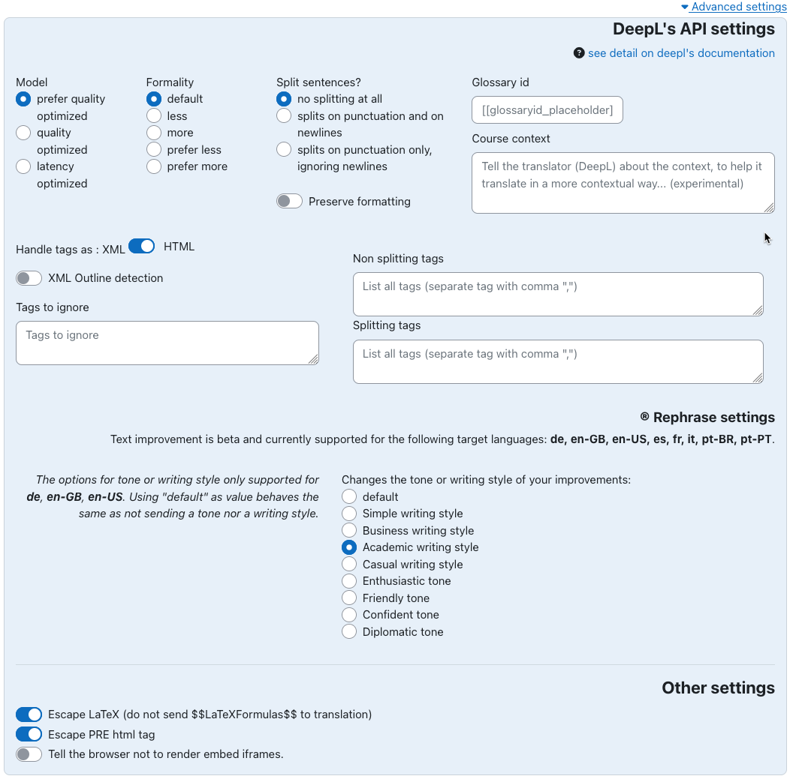
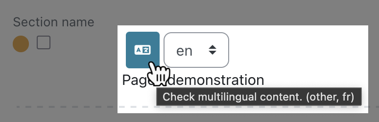
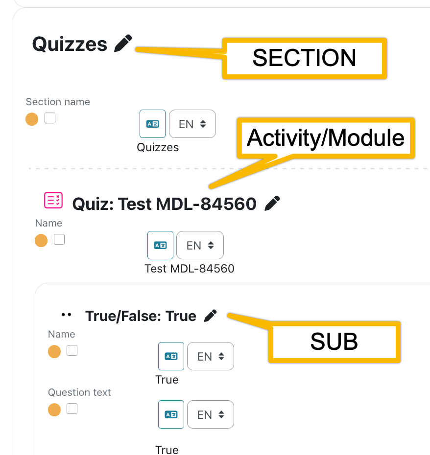

# Course Translator for Moodle

[](https://github.com/brunobaudry/moodle-local_deepler/actions/workflows/moodle-ci.yml) [](https://github.com/brunobaudry/moodle-local_deepler/actions/workflows/dependency-review.yml)
[](https://sonarcloud.io/summary/new_code?id=brunobaudry_moodle-local_deepler) [](https://sonarcloud.io/summary/new_code?id=brunobaudry_moodle-local_deepler)

Course Translator is a local moodle plugin that provides a content translation page for courses and automatic machine translation using the DeepL Pro Translation api. Currently it
can translate content two levels deep and is developed for those who want to translate a course all on one page without having to navigate to each module and update
translations.
Translation workflow being the following:

0. Fine tune your Deepl's settings.
1. Select the source language.
2. Select the target language.
3. Select the fields to translate.
4. Send to Deepl.
5. Review and or amend automated translations.
6. Save translations to Moodle's DB.

[Multi-Language Content (v2)](https://moodle.org/plugins/filter_multilang2) is a dependency of this plugin and will not work without it.

## Fork

This is a fork of Jamfire's https://github.com/jamfire/moodle-local_coursetranslator which was left deprecated with https://github.com/jamfire/moodle-filter_autotranslate for
replacement.
Though going the filter way is most probably the best way for auto translation, we found useful to improve this one adding the necessary "revision" step as Machine translation will
never be 100% accurate specially in the context of knowledge transmission where accuracy is mandatory.

## Installation

Clone or [download](https://github.com/brunobaudry/moodle-local_deepler/releases) this plugin to ```/moodlewww/local/deepler``` and run through the database
upgrade process.

## Configuration

### Permissions

Course Translator will extend Moodle with the ```local/deepler:edittranslations``` capability. Assign the capability to a new Translator role or add it to one of your
existing roles.

### Webservices

This plugin will add a ```local_deepler_update_translation``` web service for the translation page to perform ajax requests against.

### Admin

To configure the plugin, navigate to **Site Administration -> Plugins -> Local plugins -> Manage local plugins.** From this page you can configure DeepL settings, specify wether
you are using DeepL API Free or Deepl API Pro, and enable/disable the autotranslate feature on the translation page. Visit
the [DeepL API page](https://developers.deepl.com/docs/getting-started/readme) to
signup for an api key that you can enter into local plugin settings.


## Translating

To begin translating content, visit a course, open the course settings action menu, and then go to **Course Translator**.


You will be sent to the translation page for the course.

### Advanced settings

There you can fine tune Deepl's commands.


### Language selection


#### Source language

The source language will be set to the actual Moodle language selection which will automatically be set to **other**.
Changing the source language will act as if you'd change moodle's lang.
It is important, from a translation standpoint, to **select the source language from the language it was initially written** (and to stick with it).

When first translating your content the plugin will insert ```{mlang other}Your Content...{mlang}``` tags .
Please checkout the [mlang docs](https://moodle.org/plugins/filter_multilang2) to understand more.

#### Target language

To change the language you want to translate to, choose a language from the **Target language {mlang XX}** dropdown.
Note: indeed you cannot translate from and to the same language so buttons and checkboxes would be disabled if so.

### Header


### Filters

You can filter the rows to hide/show the ones that need to be translated as wished.
Clicking on the "Status" checkbox will select all visible.

These filter show/hide the textual content found in the course.

Up to date:

These are the content that are already translated and that no change were made in the source.

They will appear with the GREEN DOT indicator.

Needs update:

These are the textual contents that were never translated or that were modified after being translated.

They appear with the RED DOT indicator when they were never translated.

They appear with the ORANGE DOT indicator when they were already translated but the source text change since.

### Status indicator


Each row has a little colored dot to indicate a status:

- Red -> This field was never translated. (no {mlang} tag found)
- Orange -> This field was translated but there were some updates made in the Database. (Needs a review)
- Green -> The filed was already translated and up to date (in the target language).

### Translation process

#### Editing the source

It is not possible to edit the source content from this plugin's interface.
Nevertheless clicking on the PENCIL icon will jump you to the regular place for you to do so.


#### Reviewing past translations and multilang's tags

Clicking on the TRANSLATION icon will toggle the display of multilang tags and all available translations.



#### Images and medias.

The plugin will try to fetch and display embeded images.
When not found it will highlight the alt text in yellow and italicised as seen above.


### Performing translations


1. The text is not selected. No translation will occur. ( ... )
2. The text is selected but not sent to Deepl yet. (hourglass)
3. Translation is retrieved from Deepl and filed in the text editor. (floppy)
    1. Now the translator can review Deepl's work and amend the translation if necessary.
    2. Once happy with the content a click on the floppy button will save the text.
4. Translation is saved in the database, with the {mlang} filter surrounding it. (DB icon)

### Modules



To help the translator grasp the content's context the text are displayed in the order of appearance of the course and with a "MODULE" separator corresponding to the activities
grouping.

## User tour (inline tutorial)

You can install a [tour guide](https://github.com/brunobaudry/moodle-local_deepler/blob/main/tourguide/tour_export.json) to simplify your translators's trainings.

See moodle's instructions here : [User tours](https://docs.moodle.org/31/en/User_tours)

## WARNING

### Multi mlang xx tags inside a field

At this time, Course Translator does not have the ability to translate advanced usage of mlang in content. For example, this includes the use of multiple mlang tags spread
throughout content that utilize the same language._

### Image display

Currently images are only displayed in the preview but not in the text editor. Instead, the alt attribute content is highlighted.
The Alt attribute is not sent toi Deepl. This should be added in further improvement for better accessibility.

## Compatability

This plugin has been tested on Moodle 3.11 and Moodle 4.0.
Should work with the following editors:

- Plaintext
- Atto
- Tiny
- Marklar

## How does this plugin differs from Content Translation Manager and Content Translation Filter?

This plugin does not translate every string on your site. It is only meant for translating courses and it uses Moodle's built in multilingual features along with ```{mlang}``` to
translate your content. When you backup and restore courses, your translations will migrate with your content. Updating your source content will provide a "Update Needed" status
message on the course translation page.

## Future (todos)

- Question banks translation.
- Machine translation API abstraction to use other services than Deepl.
- Display images all times.
- Translations versioning.

## Submit an issue

Please [submit issues here.](https://github.com/jamfire/moodle-local_deepler/issues)

## Changelog

See the [CHANGES.md](CHANGES.md) documentation.

## Contributing

See the [CONTRIBUTING.md](CONTRIBUTING.md) documentation.
